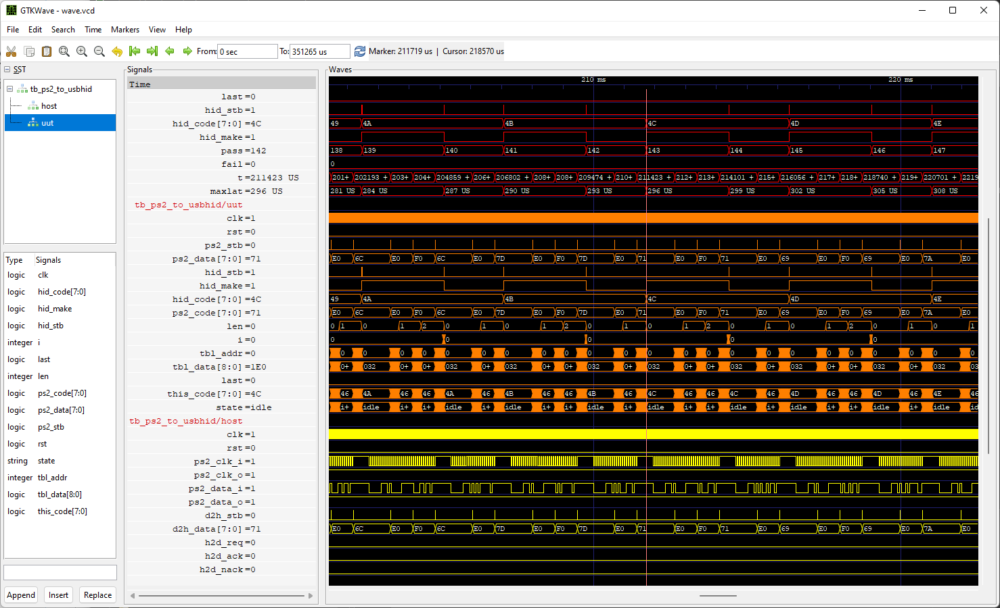

# vcd2gtkw
This script creates a [GTKWave](https://gtkwave.sourceforge.net/) waveform save file from a [value change dump](https://en.wikipedia.org/wiki/Value_change_dump) file.

 Waves are added in the order that they are found in the VCD, which normally matches the order of port and signal declarations in the design source.

 Comments are added to delineate design units, and wave colours are cycled as design units and hierarchy levels are traversed.

 The user may specify the number of hierarchy levels to descend when adding signals; by default, all signals are included.

 Usage:
 ```
 vcd2gtkw.sh vcd_filename gtkw_filename <levels>
   vcd_filename = value change dump filename
   gtkw_filename = GTKWave waveform save filename
   levels = hierarchy levels to include (optional), defaults to 0 (all)
 ```
 Example:

 
